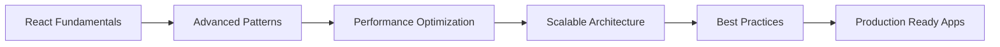

<div align="center">

# 📱 Alessio Montebello

### Mobile Developer | React Native & Expo Specialist

[](https://www.linkedin.com/in/alessio-montebello-4232b2228/)
[](https://github.com/AlessioMontebello90)
[](mailto:alessio.montebello.am@gmail.com)


</div>

---

## 👋 About Me

Mobile developer specializzato nella creazione di esperienze utente intuitive e performanti attraverso **React Native** ed **Expo**. La mia passione è trasformare design complessi in applicazioni mobile fluide e accessibili, con particolare attenzione ai dettagli e alla qualità del codice.

```javascript
const alessio = {
  location: "Milano, Italia 🇮🇹",
  currentFocus: ["React Native", "Expo", "TypeScript", "UI/UX"],

  learning: ["React Fundamentals", "Advanced TypeScript", "Mobile Performance"],
  hobbies: ["D&D 🎲", "Running 🏃‍♂️", "Tech Communities"],
};
```

---

## 🛠️ Technology Stack

<div align="center">

### Core Technologies


### UI & Styling


### Tools & Platform


### Additional Skills


</div>

---

## 💼 What I Do

<table>
<tr>
<td width="50%">

### 🎯 Current Focus

- Sviluppo di applicazioni loyalty mobile
- Implementazione di sistemi di pagamento sicuri
- Autenticazione biometrica
- Gestione punti fedeltà e rewards
- Integrazione Firebase Analytics

</td>
<td width="50%">

### 🚀 Expertise

- UI/UX pixel-perfect da Figma
- Componenti accessibili (WCAG)
- Navigation flows complessi
- Performance optimization
- Componentizzazione e riusabilità

</td>
</tr>
</table>

---

## 📊 GitHub Analytics

<div align="center">


</div>

<div align="center">

[](https://git.io/streak-stats)

</div>

---

## 🎓 Continuous Learning

<div align="center">



</div>

Sono costantemente impegnato nel migliorare le mie competenze attraverso progetti pratici, studio approfondito e applicazione di best practices nel codice di produzione.

---

## 🌟 Professional Approach

> _"La qualità non è un atto, è un'abitudine"_ - Aristotele

Mi dedico alla creazione di codice pulito, manutenibile e scalabile. Ogni componente è pensato per essere riutilizzabile, ogni interfaccia per essere accessibile, ogni esperienza utente per essere memorabile.

**Key Principles:**

- 📐 **Precision:** Attenzione maniacale ai dettagli del design
- ♿ **Accessibility:** Applicazioni utilizzabili da tutti
- ⚡ **Performance:** Esperienze fluide e responsive
- 🔄 **Maintainability:** Codice pulito e ben documentato
- 🧪 **Quality:** Test e validazione continua

---

## 📫 Get In Touch

<div align="center">

Sono sempre interessato a nuove opportunità e collaborazioni nel mondo dello sviluppo mobile.

[](https://www.linkedin.com/in/alessio-montebello-4232b2228/)
[](mailto:alessio.montebello.am@gmail.com)

**📍 Based in Milano, Italia**

</div>

---

<div align="center">

### 💡 _Crafting intuitive mobile experiences, one component at a time_


</div>
